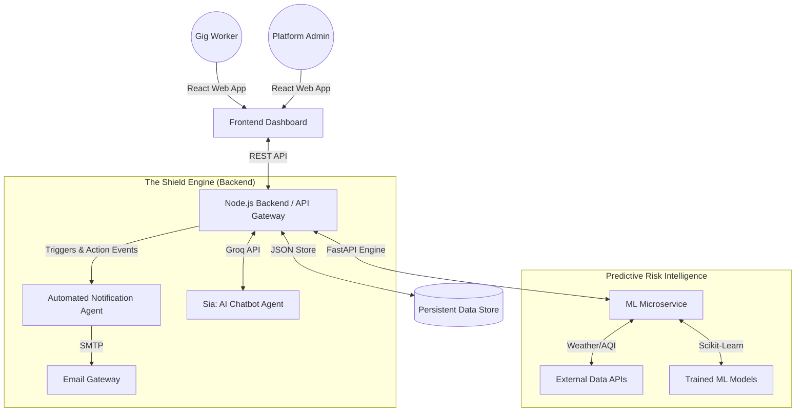

# 🛡️ GigShield: Unified Risk Orchestration for the Gig Economy
## Project Writeup for Pitch Deck & Architecture

**GigShield** is a premium, full-stack risk management ecosystem tailored specifically for the gig economy. It provides real-time disruption monitoring, hyper-local risk pricing, and automated, fraud-resistant claims processing. 

This document outlines the core features, system architecture, and technical implementations to aid in the creation of pitch decks and architecture diagrams.

---

## 🏗️ System Architecture

GigShield employs a microservices-inspired, event-driven architecture designed for high concurrency, low latency, and maximum reliability.

### Component Breakdown
1. **Frontend**: React 18, Chart.js, Recharts, Axios, Framer Motion (Animations). Serves as the Command Center.
2. **Backend**: Node.js, Express.js. Handles business logic, policy tracking, wallet management, and orchestrates other services.
3. **ML Engine**: Python 3.10, FastAPI, Scikit-Learn. Provides risk intelligence, dynamic pricing, and fraud detection.
4. **AI Agents**: 
   - **Sia (Chatbot)**: Powered by Groq (LLaMA-3) for conversational AI.
   - **Notification Agent**: Asynchronous mail queue for user updates.
5. **Data Layer**: Persistent JSON Store (Optimized for speed/hackathon).

---

## ✨ Core Features & Implementation

### 1. Active-Hour Based Insurance Billing (The "Hybrid Weekly" Model)
**What it is:** GigShield operates on a hybrid **Weekly Active-Hour** model. The pricing is structured as a "Weekly Premium", which provisions a specific allocation of protected active hours (e.g., 36 hours for the Pro Plan) for the week.
**Implementation:**
- **Hour Tracking (`remainingActiveHours`):** When a policy is purchased, it is provisioned with a set number of `coveredActiveHours` valid for a 7-day period.
- **Duration & Expiration:** A policy is bound to a strict 7-day calendar cycle. The backend scheduler runs continuously and deducts hours from the policy strictly based on the worker's active logged-in time.
- **Daily Top-Ups (Exhaustion):** If the worker consumes all their allocated `remainingActiveHours` before the 7-day week ends, their coverage pauses. They must then perform a "daily top-up" to purchase additional active hours to remain protected for the rest of the week.
- **Rollover Benefits (Carry Forward):** To ensure maximum cost-efficiency and fairness, if the 7-day week ends and there are leftover `remainingActiveHours`, those unused hours are strictly rolled over and carried forward into the next week's policy renewal.
- **Cost Efficiency:** This ensures gig workers are completely protected while working, allows flexibility for intense work weeks (via top-ups), and rewards taking time off by carrying forward unused hours so they are never penalized for sick days.

### 2. Predictive Risk Intelligence & Dynamic Pricing
**What it is:** High-fidelity predictions using Machine Learning for localized risk assessment and premium pricing.
**Implementation:**
- **ML Microservice (FastAPI)** fetches real-time data from ERA5 weather and CPCB AQI.
- **Dynamic Bundle Pricing:** Uses Random Forest models to calculate a base premium based on zone risk (e.g., static score of 0.82), historical claims, and real-time environmental seasonality.
- **Hourly Breakdown:** The backend automatically derives a `dynamicHourlyPremium` by dividing the final dynamic bundle price by the `includedActiveHours`, providing complete pricing transparency.
- **Fraud Sentry:** Scores claims by cross-referencing GPS telemetry, platform activity, and payout deviations to flag suspicious activity.

### 3. Multilingual Real-Time AI Chatbot (Sia)
**What it is:** An intelligent, context-aware conversational agent acting as a personal insurance concierge for workers.
**Implementation:**
- **Engine:** Powered by the **Groq API** running `llama-3.3-70b-versatile` for blazing-fast inference.
- **Capabilities:** Users can buy/renew policies, add/withdraw wallet funds, file manual claims, change operating zones, and get real-time info via natural language.
- **Context-Aware:** The backend injects worker context (wallet balance, active policy details, zone risk score) into the LLM prompt, allowing "Sia" to provide hyper-personalized recommendations without the user explicitly stating their details.
- **State Management:** Manages pending actions (like waiting for payment confirmation) securely within the backend state before execution.

### 4. Automated Email Notification Agent
**What it is:** A robust background worker that keeps users informed of critical account actions, policy updates, and claim payouts.
**Implementation:**
- **Mail Queue:** Implemented via `backend/services/mailQueue.js` to process emails asynchronously without blocking the main API thread.
- **Notifier Service:** Generates rich HTML templates for events like Policy Purchase, Wallet Top-up, and Claim Approvals.
- **Transport:** Uses `Nodemailer` with SMTP integration.

### 5. High-Fidelity Simulations (Trigger Engine)
**What it is:** An admin capability to stress-test the platform and simulate real-world urban disruptions.
**Implementation:**
- **Disruption Types:** `rain`, `aqi`, `heat`, `curfew`, `flood`, `cyclone`, `fog`.
- **Real-Time Webhooks:** When an admin triggers an event, it propagates to the backend, validates active policies in the affected zone, processes automatic payouts, and immediately updates the React Dashboard and fires off email notifications.

### 6. Premium Analytics Dashboard
**What it is:** The visual command center for both Gig Workers and Platform Admins.
**Implementation:**
- Built with **React 18** and styled for a dynamic, premium aesthetic.
- Features include: Live Claim Activity Ticker, Policy Performance Visualizations, Real-time Disruption Monitors, and Worker Payout Distributions.

---

## 🚀 Key Selling Points for the Pitch Deck
1. **Hyper-Flexible for the Gig Economy:** Active-hour billing is a massive disruptor. It aligns insurance costs perfectly with worker revenue streams.
2. **AI-Driven Automation:** From localized risk pricing to conversational policy management (Sia), the platform minimizes human overhead and maximizes user experience.
3. **Proactive Protection:** Automated claim triggers and payouts during monitored disruptions (like severe rain or bad AQI) mean workers get paid instantly when they can't work, without jumping through bureaucratic hoops.
