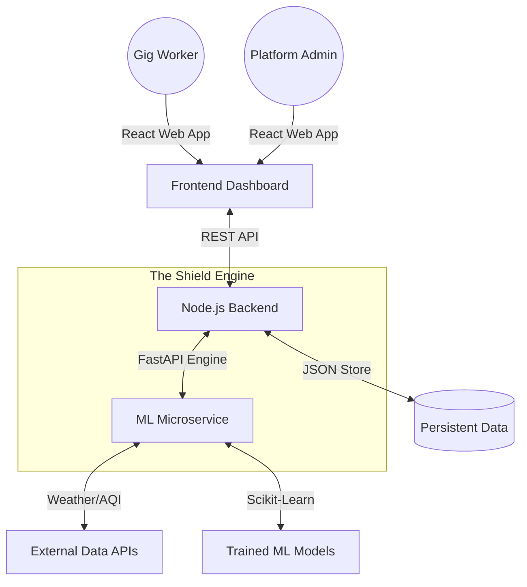

# 🛡️ GigShield v2.0: Unified Risk Orchestration for the Gig Economy

> **Empowering the Backbone of Urban Logistics with AI-Driven Protection.**

GigShield is a premium, full-stack risk management ecosystem designed specifically for the gig economy. It bridges the gap between traditional insurance and the dynamic nature of on-demand work by providing real-time disruption monitoring, hyper-local risk pricing, and automated, fraud-resistant claims processing.

---

## 🏗️ System Architecture

GigShield is built on a high-concurrency, microservices-inspired architecture that ensures low latency and high reliability.



---

## ✨ Key Platform Features

### 🧠 1. Predictive Risk Intelligence
Our specialized **ML Microservice** (FastAPI) provides high-fidelity predictions using three core engines:
- **Dynamic Premium Pricing**: Calculates worker premiums based on zone risk, historical claims, and real-time monsoon/weather factors.
- **Fraud Sentry**: A sophisticated scoring system that cross-references GPS telemetry, platform activity, and payout deviations to flag suspicious claims.
- **Payout Optimization**: Automatically calculates fair compensation based on disruption intensity and worker plan tiers.
- **Weekly Risk Forecast**: 7-day outlook for rain, heat, and AQI risks to help workers plan their shifts safely.

### 🛡️ 2. Tiered Insurance Ecosystem
- **Basic Shield**: Essential protection for high-frequency disruptions (Rain, Heat).
- **Pro Shield**: Enhanced coverage including AQI and long-tail weather events.
- **Max Shield**: Full-spectrum coverage with priority claims processing and higher payout caps.

### 🔄 3. High-Fidelity Simulations
Designed for platform stress-testing, the **Trigger Engine** allows admins to simulate various urban disruptions:
- `rain`, `aqi`, `heat`, `curfew`, `flood`, `cyclone`, `fog`.
Simulations trigger real-time updates across the dashboard, allowing for instant validation of policy responses.

### 📊 4. Premium Analytics Dashboard
An interactive React-based Command Center featuring:
- Live Claim Activity Ticker
- Policy Performance Visualizations (Recharts/Chart.js)
- Real-time Disruption Monitors
- Worker Payout Distributions

---

## 🛠️ Technology Stack

| Layer | Technologies |
| :--- | :--- |
| **Frontend** | React 18, Chart.js, Recharts, Axios, Framer Motion (Animations) |
| **Backend** | Node.js, Express.js, JWT Authentication |
| **ML Engine** | Python 3.10, FastAPI, Uvicorn, Scikit-Learn, Pandas |
| **Data Layer** | Persistent JSON Store (Optimized for speed/hackathon) |
| **Infrastructure**| Unified Bash Orchestration (`start.sh`) |

---

## 🚀 Getting Started

### Prerequisites
- **Node.js**: v16 or higher
- **Python**: v3.8 or higher with `pip3`

### The "One-Tap" Launch
GigShield is designed for easy deployment. Simply run:

```bash
chmod +x start.sh
./start.sh
```

This automated script will:
1.  **Port Cleanup**: Terminate any dangling processes on ports 3000, 4000, and 5000.
2.  **ML Setup**: Install Python dependencies and initialize the FastAPI service.
3.  **Backend Setup**: Install NPM packages and spin up the Express API.
4.  **Frontend Setup**: Initialize the React development server.

---

## 🧠 ML Pipeline & Training

The ML service follows a standard high-performance data pipeline:

1.  **Data Ingestion** (`fetch_real_data.py`): Fetches historical ERA5 weather and CPCB AQI data.
2.  **Feature Engineering** (`build_features.py`): Engineers monsoon flags, rolling risk averages, and zone-specific metrics.
3.  **Model Training** (`train_models.py`): Trains Random Forest classifiers/regressors for premium pricing and fraud detection.
4.  **Inference Service** (`main.py`): Exposes the trained models via high-speed FastAPI endpoints.

---

## 📍 API Reference (Service Endpoints)

| Method | Endpoint | Description | Service |
| :--- | :--- | :--- | :--- |
| `POST` | `/premium/calculate` | Compute dynamic worker premiums | ML Service |
| `POST` | `/fraud/score` | Analyze claim legitimacy | ML Service |
| `POST` | `/api/triggers/simulate` | Trigger a disruption event | Backend |
| `GET` | `/api/dashboard/stats` | Retrieve platform-wide metrics | Backend |

---

## 🚧 Roadmap & Future Work

- [ ] **Blockchain Integration**: Move claims and payouts to a transparent Smart Contract (Solidity/EVM).
- [ ] **Real-time GPS Telemetry**: Direct integration with delivery partner apps for zero-trust GPS validation.
- [ ] **Multi-Zone Scaling**: Support for nationwide city-specific risk modeling.

---

## 🤝 Project Credits

Developed as part of the **Guidewire Hackathon**. GigShield aims to redefine urban risk management through the power of data and AI.

> [!TIP]
> Use the **Swagger UI** for real-time ML API testing: [http://localhost:5000/docs](http://localhost:5000/docs)

---

*Engineered with precision for the future of work.*
